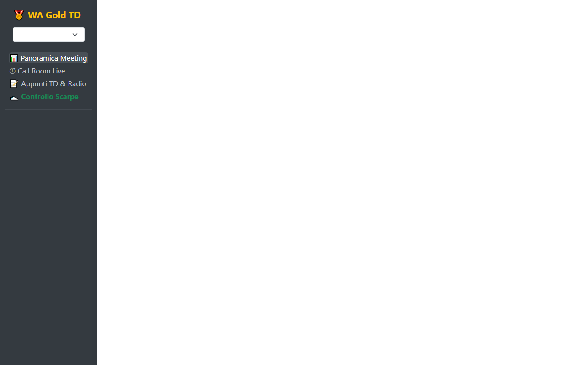
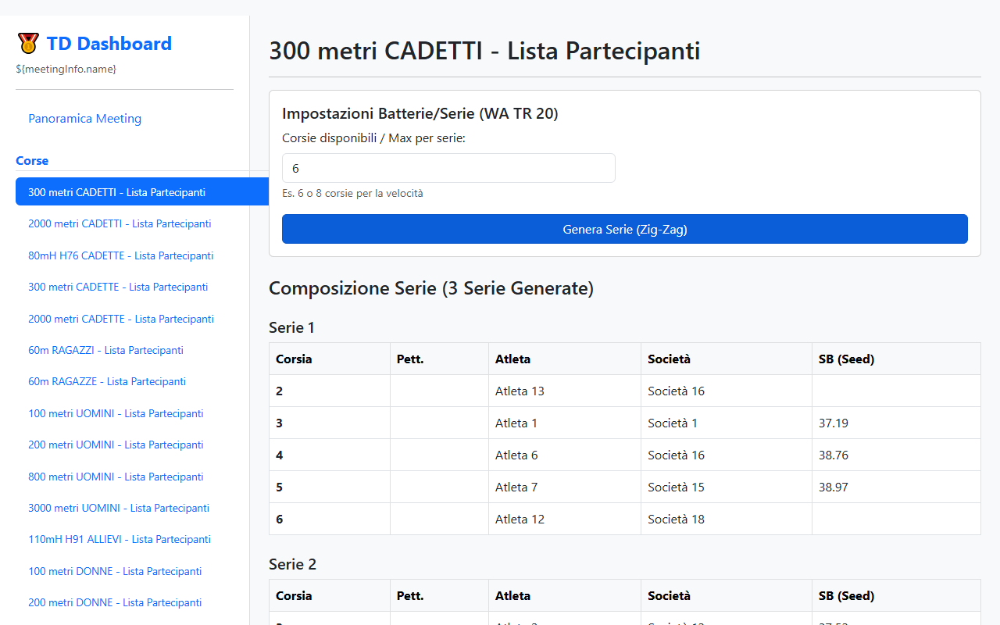
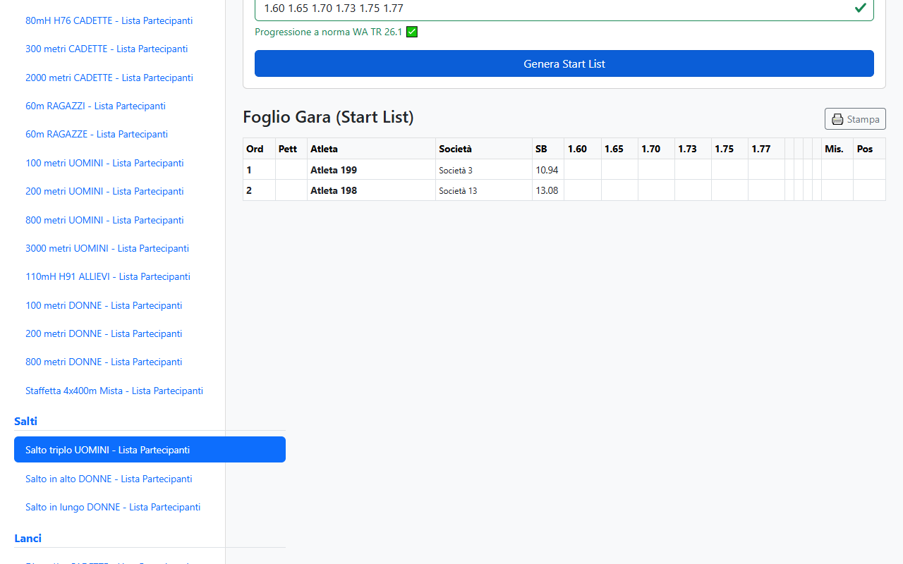

# 🥇 WA Gold - Technical Delegate Dashboard

Un'applicazione locale stand-alone progettata per supportare i Delegati Tecnici di atletica leggera (livello World Athletics Gold) nella gestione delle competizioni, nell'applicazione del Regolamento Tecnico (TR 20 e TR 25) e nella creazione ottimizzata delle Start List.

## ✨ Funzionalità Principali

1. **Estrazione Dati (Scraping)** 
   Estrazione automatica degli iscritti da qualsiasi pagina indice di un meeting FIDAL. Nessun inserimento manuale richiesto!
2. **Supporto Decisionale Offline**
   La dashboard HTML generata è completamente nativa, stand-alone e *client-side*, permettendo al TD di prendere decisioni anche sul campo senza connessione a internet.
3. **Seeding Automatico Corse (Regola TR 20)**
   - Composizione del numero esatto di batterie (Heats) basato sulle corsie a disposizione.
   - Distribuzione degli atleti a "Zig-Zag" in base al Season Best (SB).
   - Assegnazione automatica delle **corsie preferenziali** (es. 3, 4, 5, 6 su piste a 6 corsie) alle teste di serie della relativa batteria.
4. **Seeding Automatico Concorsi (Regola TR 25)**
   - Algoritmo per **Random Draw** (sorteggio casuale consigliato per le qualificazioni).
   - Algoritmo a **Ordine Inverso** (i migliori SB saltano/lanciano per ultimi, ideale per le Finali).
5. **Intervento Manuale e Persistenza**
    - Possibilità di spostare manualmente un atleta da una batteria all'altra tramite un pratico menu a tendina.
    - Tutte le serie generate e modificate vengono **salvate in cache (LocalStorage)** per non perdere i dati navigando tra le pagine.
6. **Materiale per Giudici e Segreteria (Stampe)**
    - Fogli Gara formattati per i salti in estensione e lanci (3+3 prove).
    - Fogli Gara per salti in elevazione (Alto/Asta) con griglia progressioni.
    - **Fogli Contagiri Automatici** generati automaticamente per le gare da 800m a 10000m.
    - Stampe pulite (i menu scompaiono automaticamente su carta).
7. **Controllo Scarpe (Regola TR 5)**
    - Strumento rapido integrato per consultare il database ufficiale *WA Shoe CertCheck*.
    - Riepilogo sempre aggiornato degli spessori massimi ammessi in pista e pedana.

## 🚀 Come Utilizzare il Progetto

### Primo Avvio (Installazione)
1. Assicurati di avere [Node.js](https://nodejs.org/it) installato sul tuo computer.
2. Fai doppio clic sul file **`Install_Requisiti.bat`**. Questo installerà automaticamente le librerie necessarie (Playwright) per far funzionare il programma. Questa operazione va fatta solo la prima volta.

### Utilizzo Quotidiano
1. Sul tuo Desktop o nella cartella del progetto, avvia il file **`Avvia Scraping FIDAL.bat`**.
2. Apparirà una finestra di dialogo. Incolla l'URL del meeting (va bene sia il link alla pagina degli iscritti `IndexPerGara.html`, sia il link generico del calendario). Il sistema normalizzerà l'URL **automaticamente**.
3. Lo script aprirà Microsoft Edge in background per scaricare i dati aggiornati in pochi secondi.
4. Al termine, si aprirà istantaneamente la **TD Dashboard** nel tuo browser.

## 📸 Anteprima e Interfaccia (Dati Anonimizzati)

### 1. Panoramica del Meeting
Una vista immediata sui numeri del meeting per capire subito quante gare hanno atleti sprovvisti di Season Best (No Time / No Mark).

### 2. Gestione Corse e Velocità
Selezionando una gara su pista dal menu laterale, è possibile indicare le corsie dell'impianto per generare le Starting List perfette per la Call Room.

### 3. Gestione Concorsi (Salti e Lanci)
Possibilità di gestire l'ordine di partenza (pedana) con un semplice clic.

## 🛠 Requisiti Tecnici
- Sistema Operativo Windows
- Node.js installato
- Browser Chromium/Microsoft Edge 

## ⚖️ Licenza e Disclaimer
Questo progetto è distribuito con licenza **[Creative Commons Attribution-NonCommercial-ShareAlike 4.0 International (CC BY-NC-SA 4.0)](https://creativecommons.org/licenses/by-nc-sa/4.0/)**.

Puoi condividere e modificare il materiale, a patto di citare l'autore, non utilizzarlo per scopi commerciali e distribuire le modifiche con la stessa licenza.

*Questo software è un progetto non ufficiale, sviluppato esclusivamente come strumento di ausilio tecnico-decisionale. I dati prelevati pubblicamente dalla FIDAL restano proprietà intellettuale della Federazione (L. 633/1941) e non devono essere usati per scopi commerciali di terze parti o ripubblicazione non autorizzata.*
